# 目录

1. [使用ssh](#使用ssh)
2. [codexCLI](#codexcli)

## 使用ssh

步骤1：生成 SSH 密钥

```c#
# 使用 Git Bash 或 PowerShell 生成密钥
ssh-keygen -t ed25519 -C "your_email@example.com"

# 按回车接受默认路径（~/.ssh/id_ed25519）
# 可以设置密码短语，也可以留空直接回车
```

步骤2：查看并复制公钥

```c#
# 查看公钥
Get-Content $env:USERPROFILE\.ssh\id_ed25519.pub

# 输出类似：ssh-ed25519 AAAAC3NzaC1lZDI1NTE5AAAAI... your_email@example.com

```

步骤3：添加公钥到 Gitee
复制上面的公钥内容（整个一行）
登录 Gitee
设置 → SSH 公钥 → 添加公钥
粘贴公钥，点击 确定  

步骤4：测试连接

```c#
ssh -T git@gitee.com
//成功输出
Hi 用户名! You've successfully authenticated, but GITEE.COM does not provide shell access.

```

步骤5：克隆仓库

```c#

git clone git@gitee.com:shushuhs/wain-learn.git D:/wainhs/wain-learn
```

b92df3d3fb3c88c8c4726acf9d598e5e

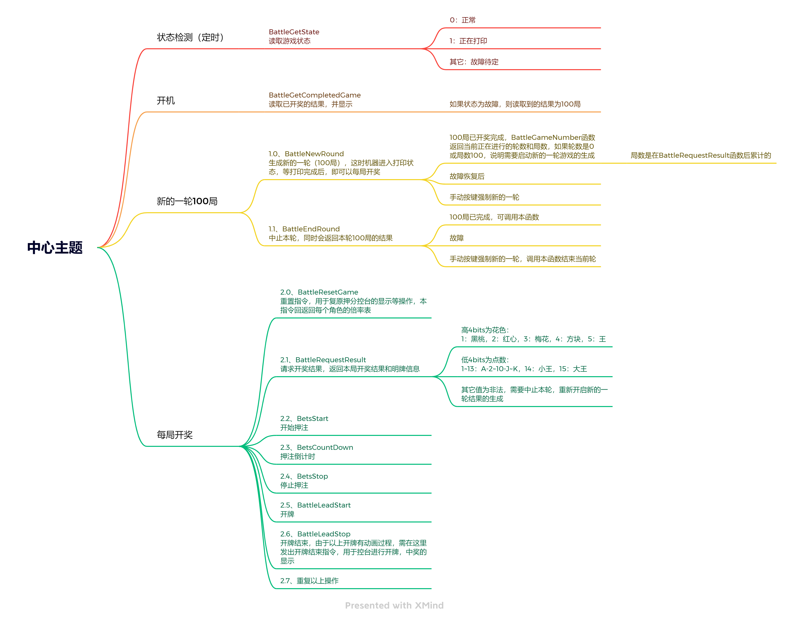  

## SBox

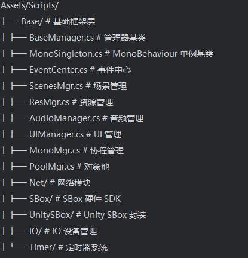
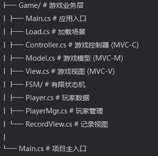

## 打包流程

1. 改unity文件 version “100.6.7” 100是国外的，给测试区分上分模式 尾数加一
2. 点击unity中HybridCLR -> Generate -> LinkXml
3. 点击unity中Tools -> Copy Dll
4. Build Settings -> 勾选 Export Project
5. android5.x插u盘更新(去掉了android7.0兼容)工具 -> 将signapk文件复制到打包目录上一级 ->
android5.x插u盘更新(去掉了android7.0兼容)将此文件中的两个文件复制替换到出包目录
6. 用Android Studio 打开项目修改 版本号
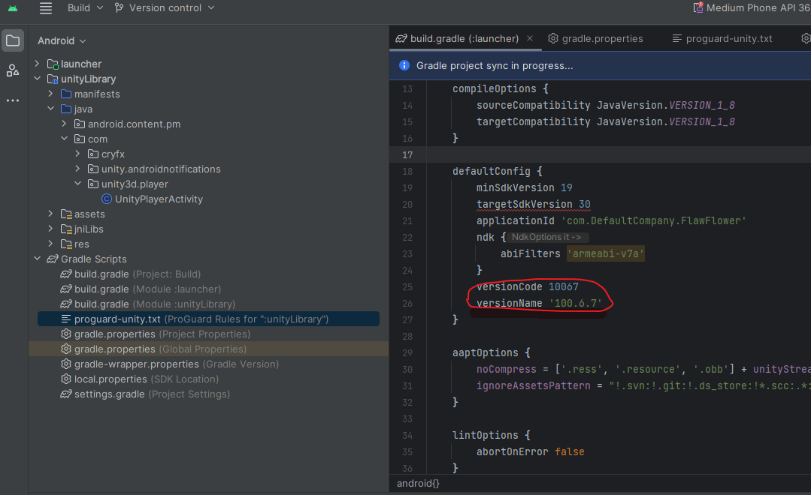
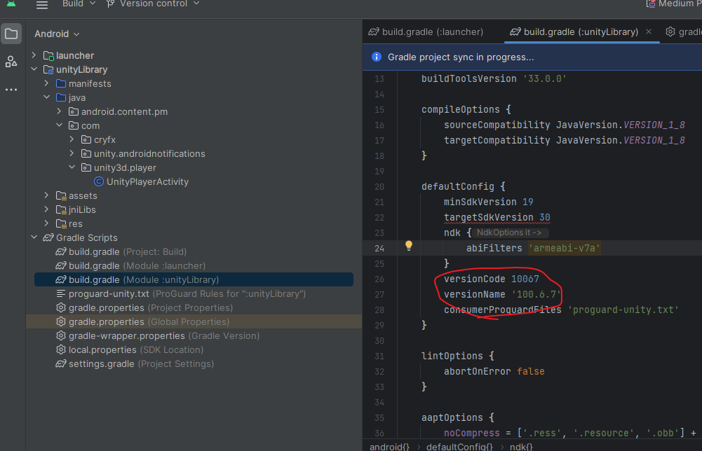
7. 打包
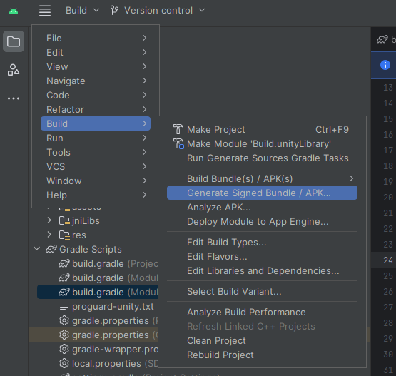
密码 test123
图中Key store path 为signapk中的slot.jks
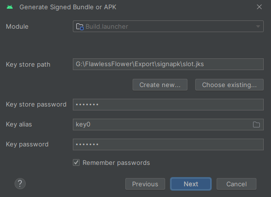
8. 将打包好的release包复制替换到signapk文件夹中，编辑start_sign.bat修改名称后运行
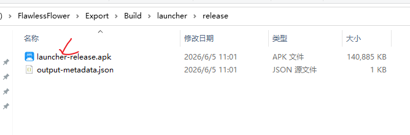
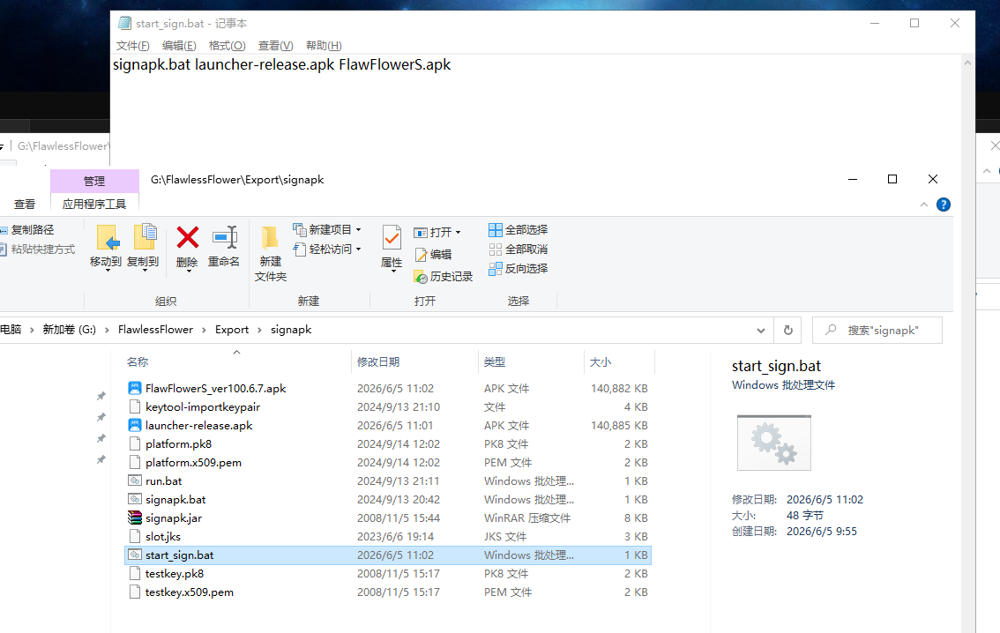
9. 将工具改好的apk加上版本号（如有debug名称后加上_Debug）上传到WinScp通知测试组测试
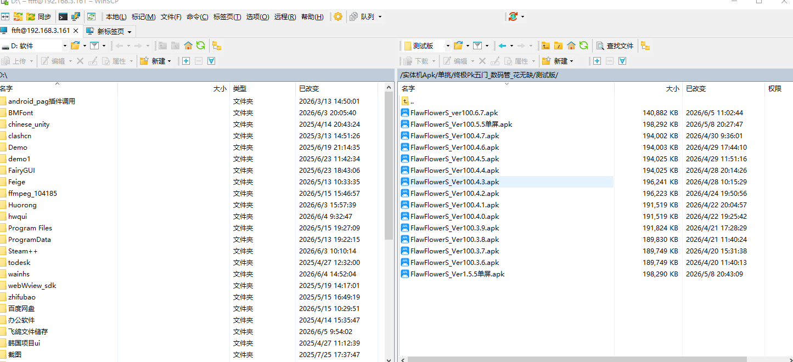

## 快捷方式（已经配好过环境）

1. 改unity文件 version “100.6.7” 100是国外的 尾数加一
2. 点击unity中HybridCLR -> Generate -> LinkXml
3. 点击unity中Tools -> Copy Dll
4. Build Settings -> 勾选 Export Project
5. 将unity打的包放在一个临时文件Temp中 将文件里的两个文件复制到Build文件夹对应位置
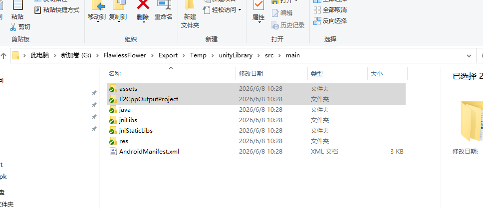
6. 安卓打开项目打包

## 测试ip

SBoxInit.Instance.Init("192.168.3.82", OnInitSBox);

## 环境问题

注意jdk版本使用1.8version
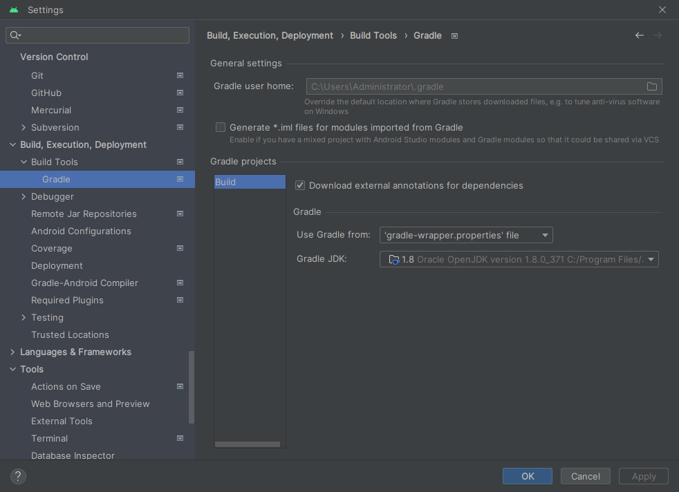
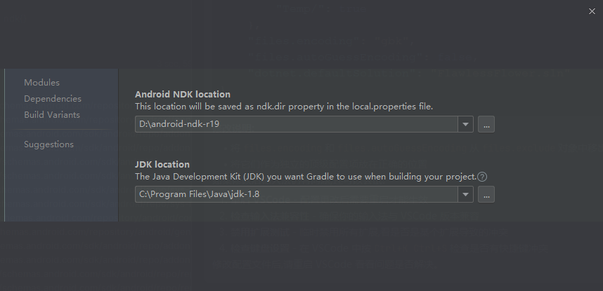

## Unity3D中 TimeLine打成AB包的BUG

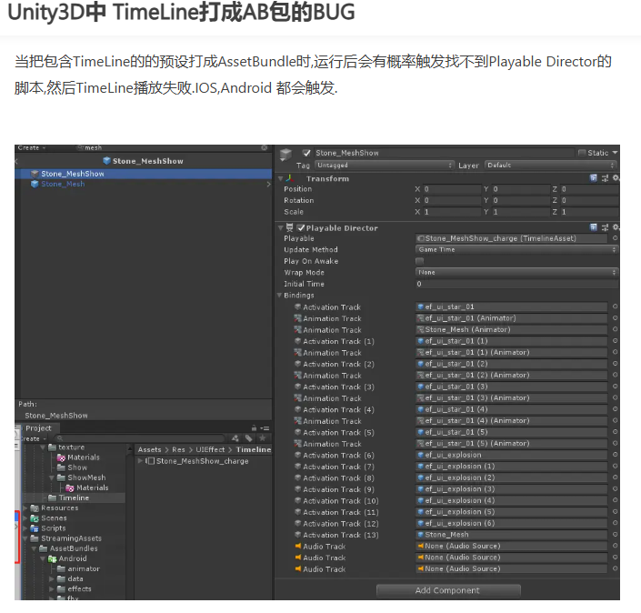
经过多方尝试后,发现只要打包前将包含TimeLine的预设打开一次,再次打包则能修复TimeLine播放失败的BUG.(老中医解决方案).

## unity字体创建

[unity字体创建](https://www.cnblogs.com/imteach/p/10743725.html)

## codexCLI

npm install -g @openai/codex

之前配过cluade code
在ccswitch中配置好codex的模型就行
配完rider的ccgui 改一下api 就自动好了

## 接入claude code

1. 前置依赖  
下载git
[git链接](https://registry.npmmirror.com/binary.html?path=git-for-windows)


1. Claude Code 主要通过 npm 包分发，因此 Node.js 是必需项。
检查 Node.js 是否安装：win + R 输入 cmd 打开终端输入以下命令，确保版本在 16.0 以上（推荐 18+）。  
如果你还没有安装 Node.js，请前往 [nodejs.org](https://nodejs.org/zh-cn)下载安装长期支持版（LTS  
输入以下代码 查看是否安装

```c#
node --version
npm --version

# 安装claude code
# 以管理员身份打开 Powershell 或命令提示符

# 全局安装
npm install -g @anthropic-ai/claude-code

# 验证安装
claude --version


```

1. 下载ccswitch 配置api
[ccswitch链接](https://www.ccswitch.io/zh/)

2. 下载vscode 安装插件 Claude Code for VS Code 或者 rider 安装插件 ccgui

# 打码网站

https://mc.cfkj88.com/  

cfkj01  

cfkj01@01

1. 打开游戏，修改游戏机台号，打开设置的激活报码 一一对应
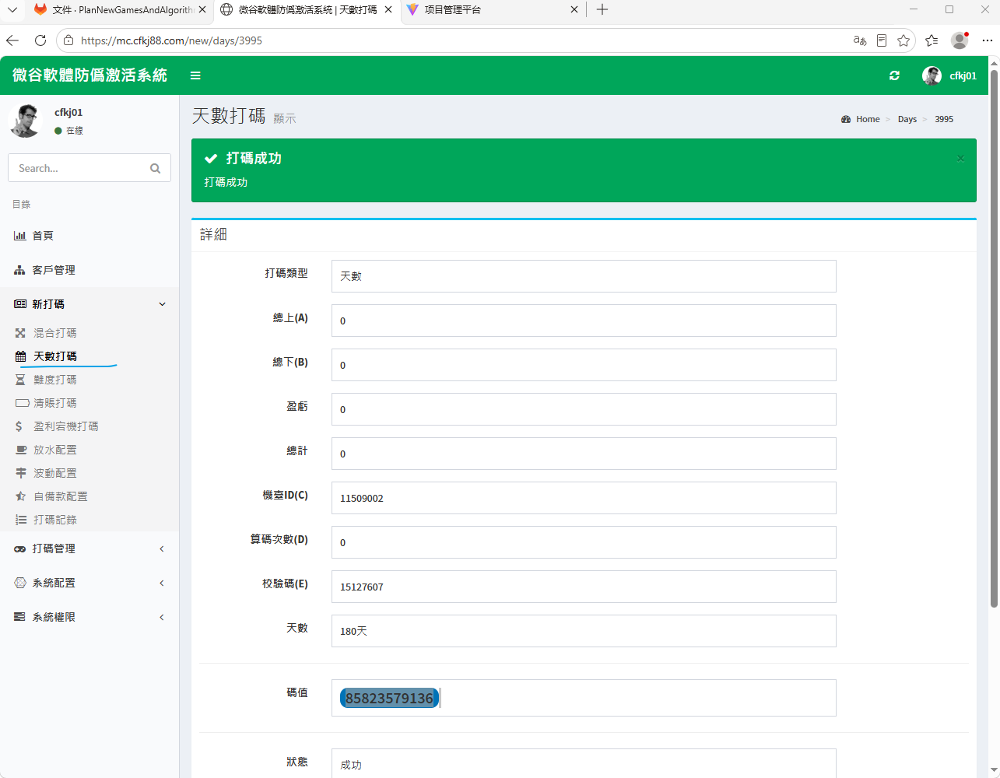
